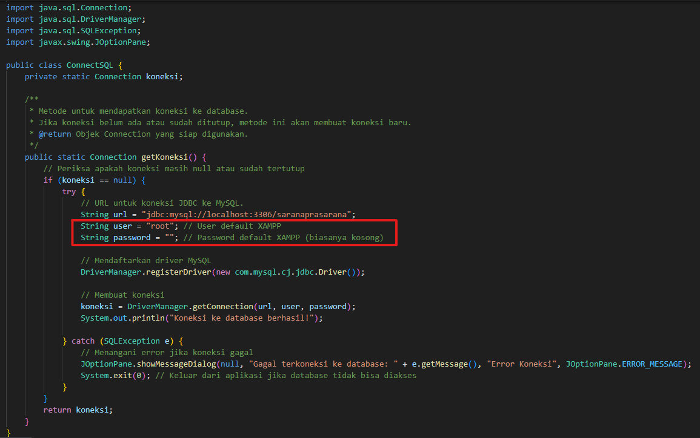

# APLIKASI SARANA PRASRANA 🗄️
Aplikasi untuk mengatur peminjaman dan pelaporan sarana prasarana sebagai bentuk pemenuhan tugas mata kuliah Algoritma dan Pemrograman 2

----

## 🔧 INSTALASI
### 1. Buka Xampp lalu jalankan Apache dan MySQL

---

### 2. Buka phpMyAdmin melalui `http://localhost/phpmyadmin/index.php` lalu buat database `saranaprasarana`

---

### 3. Buka menu import pada phpMyAdmin lalu import file `saranaprasarana.sql`

---

### 4. Jika konfigurasi database XAMPP anda ubah maka sesuaikan username dan password pada `ConnectSQL.java`

---

### 5. Buka aplikasi melalui `Aplikasi Sarana Prasarana.jar` (Pastikan xampp menyala)
-   **Admin**: Username dan password = `q`
-   **Petugas**: Username dan password = `a`
-   **User**: Username dan password = `z`

