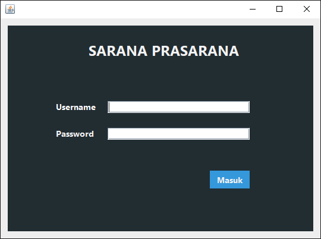

# APLIKASI SARANA PRASRANA 🗄️
Aplikasi untuk mengatur peminjaman dan pelaporan sarana prasarana sebagai bentuk pemenuhan tugas mata kuliah Algoritma dan Pemrograman 2

----

## 🔧 Cara Penggunaan
### 1. Buka aplikasi menggunakan `Aplikasi Sarana Prasarana.bat`

---

### 2. atau buka pada folder `dist` melalui `AplikasiSaranaPrasarana.jar`

---

### 3. Pada login bukalah aplikasi menggunakan user dibawah
-   **Admin**: Username dan password = `q`
-   **Petugas**: Username dan password = `a`
-   **User**: Username dan password = `z`

